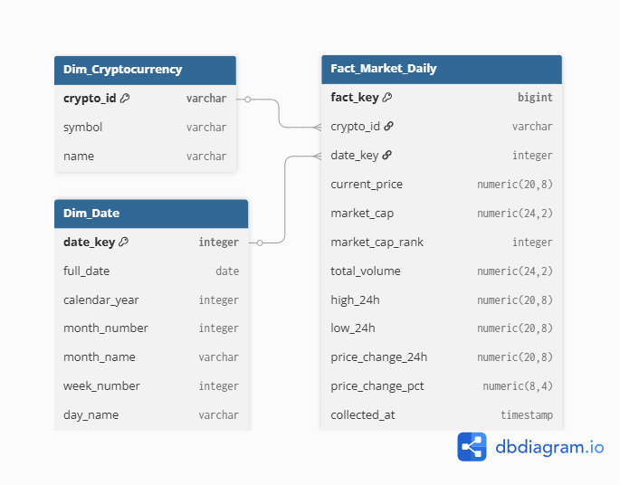

# Étape 0.2 — Modèle Dimensionnel du Data Warehouse

This document outlines the dimensional modeling strategy designed for the cryptocurrency market data warehouse pipeline.

## 1. Design Overview & Justification

* **Business Process Target:** Tracking daily market asset valuations, monitoring global liquidity shifts through traded volume, and analyzing historical 24-hour price extremes.
* **Granularity:** Exactly **one record per unique cryptocurrency per calendar day** (Daily grain).
* **Schema Choice:** **Star Schema**
  * *Justification:* Selected over a Snowflake schema to minimize query execution `JOIN` overhead within Snowflake, simplify downstream relationship mapping in Tableau, and offer the highest read-performance for analytical queries.

---

## 2. Data Dictionary

### Fact Table: `Fact_Market_Daily`

Houses the rapidly changing numerical measurements collected daily from the CoinGecko API.

| Column Name          | Data Type          | Key Type                   | Description                                           |
| :------------------- | :----------------- | :------------------------- | :---------------------------------------------------- |
| `fact_key`         | `BIGINT`         | **Primary Key (PK)** | Auto-incrementing unique row identifier.              |
| `crypto_id`        | `VARCHAR`        | **Foreign Key (FK)** | Links to `Dim_Cryptocurrency`.                      |
| `date_key`         | `INTEGER`        | **Foreign Key (FK)** | Links to `Dim_Date` (Format: `YYYYMMDD`).         |
| `current_price`    | `NUMERIC(20, 8)` | None                       | Spot rate price at retrieval timestamp.               |
| `market_cap`       | `NUMERIC(24, 2)` | None                       | Total outstanding network market capitalization.      |
| `market_cap_rank`  | `INTEGER`        | None                       | Global capitalization ranking position.               |
| `total_volume`     | `NUMERIC(24, 2)` | None                       | Aggregate 24-hour liquidity transaction movement.     |
| `high_24h`         | `NUMERIC(20, 8)` | None                       | Peak value reached over the rolling 24-hour window.   |
| `low_24h`          | `NUMERIC(20, 8)` | None                       | Lowest value reached over the rolling 24-hour window. |
| `price_change_24h` | `NUMERIC(20, 8)` | None                       | Net nominal fiat currency value change.               |
| `price_change_pct` | `NUMERIC(8, 4)`  | None                       | Net percentage price shift.                           |
| `collected_at`     | `TIMESTAMP`      | None                       | Source extraction reference timestamp.                |

### Dimension Table: `Dim_Cryptocurrency`

Tracks the descriptive reference identifiers for tracked digital assets.

| Column Name   | Data Type   | Key Type                   | Description                                       |
| :------------ | :---------- | :------------------------- | :------------------------------------------------ |
| `crypto_id` | `VARCHAR` | **Primary Key (PK)** | Unique string identifier (e.g.,`'bitcoin'`).    |
| `symbol`    | `VARCHAR` | None                       | Official ticker symbol (e.g.,`'btc'`).          |
| `name`      | `VARCHAR` | None                       | Full descriptive asset name (e.g.,`'Bitcoin'`). |

### Dimension Table: `Dim_Date`

Handles custom time hierarchies to natively support drill-down metrics (*Year > Month > Week > Day*) within Tableau.

| Column Name       | Data Type   | Key Type                   | Description                                             |
| :---------------- | :---------- | :------------------------- | :------------------------------------------------------ |
| `date_key`      | `INTEGER` | **Primary Key (PK)** | Numeric key sequence (e.g.,`20260609`).               |
| `full_date`     | `DATE`    | None                       | Standard structural database date format.               |
| `calendar_year` | `INTEGER` | None                       | Year component identifier (e.g.,`2026`).              |
| `month_number`  | `INTEGER` | None                       | Calendar month position index (`1` to `12`).        |
| `month_name`    | `VARCHAR` | None                       | Textual month name representation (e.g.,`'June'`).    |
| `week_number`   | `INTEGER` | None                       | Standard ISO week numbering position.                   |
| `day_name`      | `VARCHAR` | None                       | Textual day classification string (e.g.,`'Tuesday'`). |

---

## 3. Entity-Relationship Diagram (ERD)

