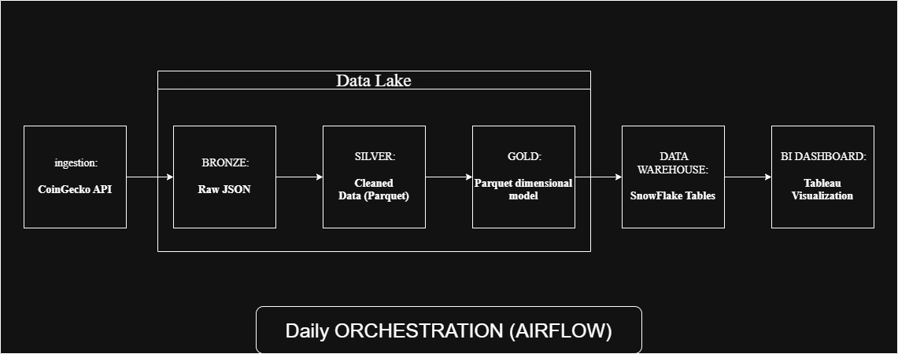

# Étape 0.1 — Architecture End-to-End du Pipeline

This document details the architectural layout, data layers, and tooling configurations utilized for the automated cryptocurrency data pipeline.

## 1. End-to-End Architecture Diagram

Below is the graphical design mapping out the data lineage from core extraction down to analytical visualization assets.

## 2. Infrastructure & Data Layer Breakdown

### A. Ingestion Layer (Source)

* **Technology:** Python `requests` library extracting data from the **CoinGecko API** (`/coins/markets` endpoint).
* **Scheduling:** Automated daily execution intervals.

### B. Storage Layer / Data Lake (Medallion Architecture)

The project utilizes an S3-compatible **MinIO** object storage framework organized into three distinct operational layers:

1. **Bronze (`crypto-bronze`):** Houses raw, untouched JSON API responses (`YYYY/MM/DD/raw.json`). Serves as an immutable ledger to safely replay data workflows if upstream schemas break.
2. **Silver (`crypto-silver`):** Parquet storage containing structured data cleaned via `pandas` (missing-value adjustments, column drops, and explicit type castings).
3. **Gold (`crypto-gold`):** Finalized dimensional schema tables saved in isolated Parquet formats (`Fact_Market_Daily`, `Dim_Cryptocurrency`, `Dim_Date`) ready for direct cloud synchronization.

### C. Data Warehouse Layer

* **Technology:** **Snowflake**
* **Execution:** Python-native connections load data records systematically. Computations map 1:1 with the validated dimensional structures.

### D. Semantic & Analytics Layer

* **Technology:** **Tableau Desktop / Web**
* **Integration:** Connected via the official Snowflake ODBC driver wrapper. Preserves standard primary-to-foreign key relationships to leverage quick drill-downs across custom calculations.
